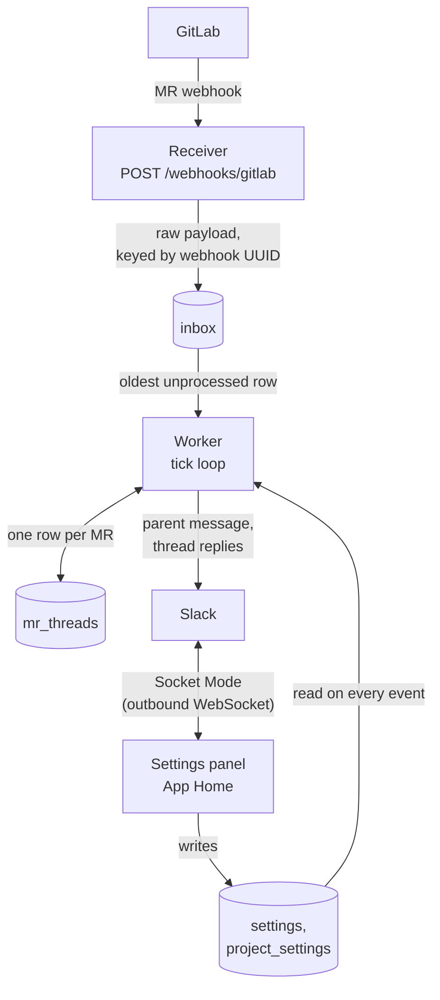

# GitLab → Slack MR Threads

One merge request = one Slack thread. Parent message stays live with current status; lifecycle events post as threaded replies.

## What it does

- Receives GitLab MR webhooks.
- Creates a Slack parent message on MR open.
- Updates the parent's status on every state change (draft, approved, merged, closed).
- Posts a short threaded reply for each event, including "all threads resolved".
- Mentions the MR author and reviewers so they actually get pinged.
- Settings live in the database and are edited from the bot's App Home page in Slack.
- One durable `(project_id, mr_iid) → slack_thread_ts` mapping per MR.
- Safe against duplicate webhook deliveries.
- Safe across restarts.

## What it does not do (yet)

See [`docs/roadmap.md`](docs/roadmap.md).

## Quick start (local)

See [`docs/local-setup.md`](docs/local-setup.md).

## Deployment

See [`docs/deployment.md`](docs/deployment.md).

## Configuration

Split in two:

- **Env** — secrets, the deployment shape, and what is needed before the database is open:
  tokens, the webhook secret, `DATABASE_URL`, `PORT`, `LOG_LEVEL`, poll intervals, and
  `SLACK_ADMIN_USER_IDS`. See `.env.example`.
- **The settings panel** — everything else: default channel, per-project channels and on/off,
  mentions, Jira link and ticket-key pattern, user overrides. Edited from the bot's Home tab in
  Slack, stored in the database, applied to the next event without a restart.

A fresh instance boots unconfigured and holds incoming events until someone picks a default
channel. See [`docs/deployment.md`](docs/deployment.md).

## Running tests

~~~
bun install
bun run test            # vitest
bun run test:coverage   # + v8 coverage, fails below 95% (lines, statements, functions, branches)
bun run test:mutation   # Stryker: are the tests actually checking anything?
bun run test:e2e        # builds, then drives the compiled bot over a real socket
~~~

All tests run in-process against a temp SQLite file and a fake Slack client. No external dependencies at test time.

A pre-commit hook runs `bun run test:coverage` so coverage cannot quietly slide. It uses git's
config-based hooks (git 2.54+), so it is version-controlled in `.githooks/config` — enable it once
per clone:

~~~
git config --local include.path ../.githooks/config
~~~

## Architecture at a glance

- **Receiver** (Fastify `POST /webhooks/gitlab`): verifies `X-Gitlab-Token`, writes the raw payload to a durable SQLite `inbox` table keyed by `X-Gitlab-Webhook-UUID`, returns 200 in under 50 ms.
- **Worker** (in-process tick loop): claims the oldest unprocessed inbox row, derives the MR's new status, mutates the `mr_threads` row, calls Slack.
- **Settings panel** (Slack App Home over Socket Mode): an outbound WebSocket, so no inbound Slack endpoint exists. Renders the current state and writes changes to the settings tables.
- **SQLite** as queue + store. Single-process by design.

## Known limitations

- **Single instance only.** Running >1 replica will double-process inbox rows. If you need HA, migrate to Postgres and add `SELECT … FOR UPDATE SKIP LOCKED` to the worker's claim query.
- **GitLab's `X-Gitlab-Token` is a plaintext shared secret.** Always run behind TLS.
- **No retries for `channel_not_found`.** The panel refuses to save a channel the bot is not in, so this should not happen any more. If a row failed under an earlier configuration, invite the bot and reset it manually (see `docs/deployment.md`).
- **The settings panel needs one instance.** Socket Mode opens one connection per process, which matches the single-instance constraint above.

## License

Internal — Example Workspace.
